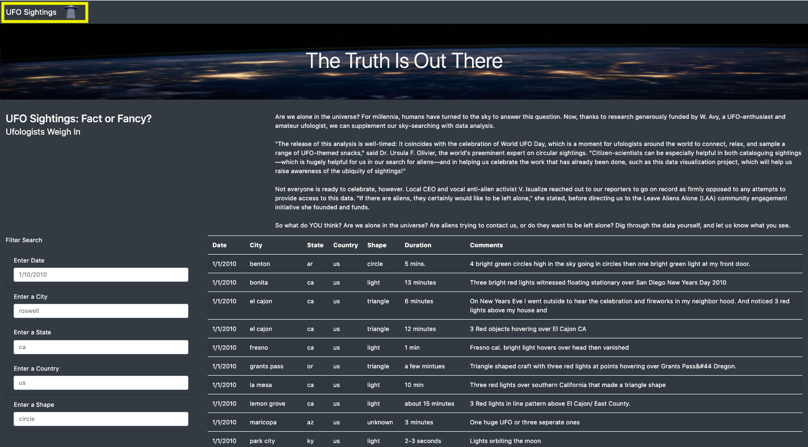
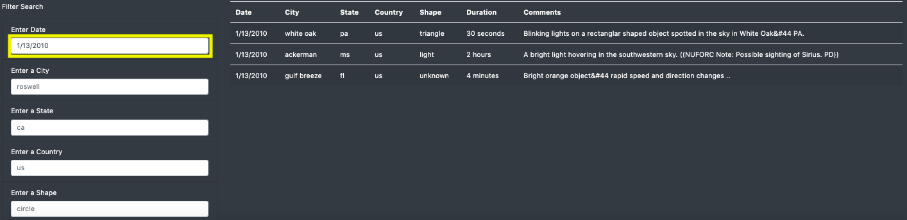
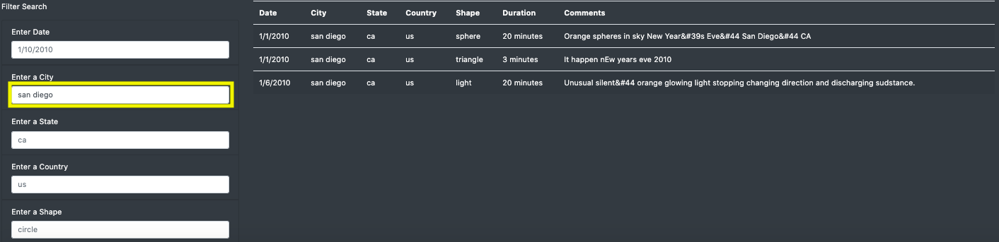
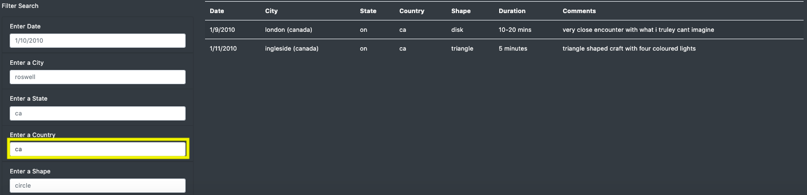
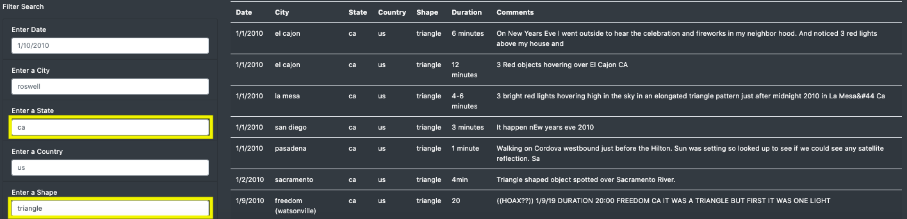

# UFOs

## Project Overview
This project focuses on building a dynamic webpage that accepts user inputs and adjusts accordingly to display information about UFO sightings.\
In order to perform their analysis, users will be able to filter the UFO sightings table based on multiple criteria such as the event date, city, state, country and shape. 

## Results

### UFO Sightings webpage
The deployed webpage is accessible by downloading the relavent repository files onto your local drive and running the [index.HTML](index.HTML) file 

### Search Criteria Procedure

#### Index page
This is the initial page. The user can re-initialize the page by clicking on the navbar at the top.

     

#### Filtering by event date
The user enters the desired date, the change is detected and the table is updated accordingly.

     

#### Filtering by city
The user enters the desired city, the change is detected and the table is updated accordingly.

     

#### Filtering by country
The user enters the desired country, the change is detected and the table is updated accordingly.

     

#### Filtering by state and shape
The user enters the desired state and shape observed, the changes are detected and the table is updated accordingly.

     

All filter parameters can be entered simultaneously.
 

## Summary
**Drawbacks:**

While working on this file I noticed several drawbacks which made it quite inefficent to use. Some are as below:

* The search field is "case-sensitive". Specifically, the table does not update or give the required results / comes up blank if the information is not input exactly per the data source. For example, under states if I input 'AR' as opposed to 'ar', the table will come up blank. 

* As mentioned before, the data source is not 'live' and thus not constantly updated which is why accurate results are not possible to obtain.

**Recommendations for further development:**

I do however believe that the following improvements can enhance the user experience immensely:

* If the search criteria is no longer case sensitive, it will ensure ease and flexibility in searching through the data.

* It will overall improve the webpage by leaps and bounds if it is connected to a 'live' data source.

* In order to make the interface more user-friendly, there should be various other functions added therein the search bar specifically drop down lists, multiple choice selections etc. Specifically with the options such as those for States and Shapes where they are a limited amount this could prove to be quite useful.
 

